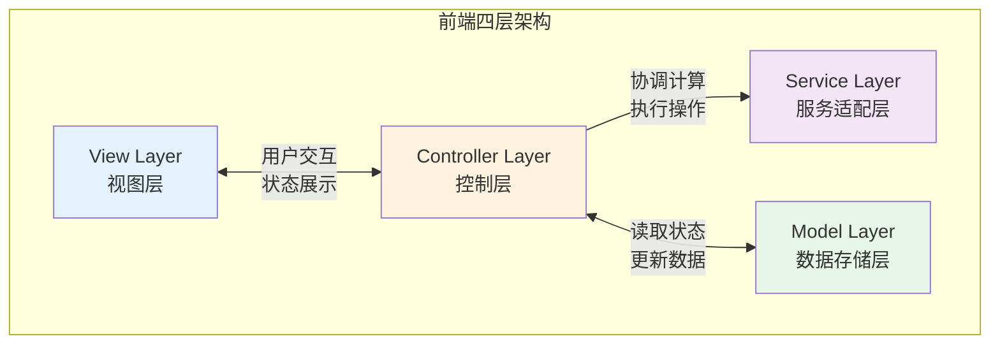
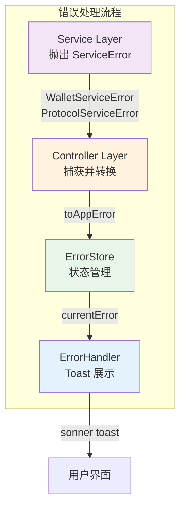
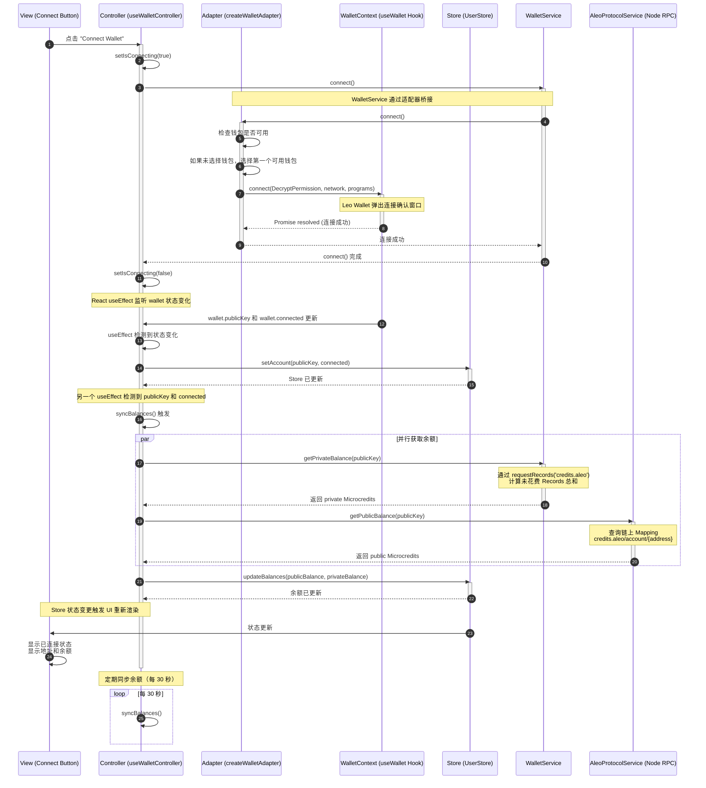
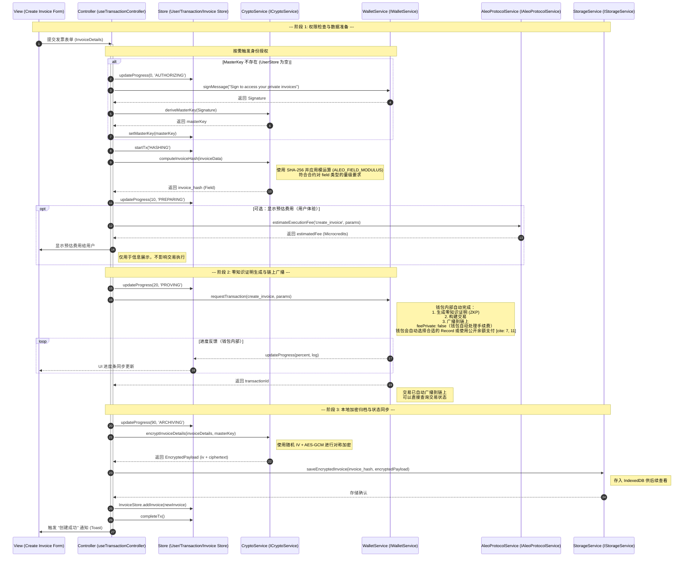
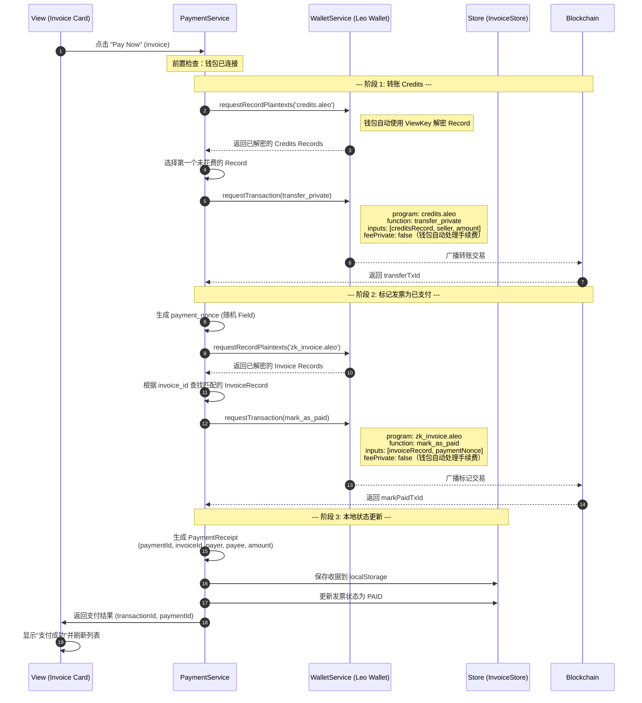
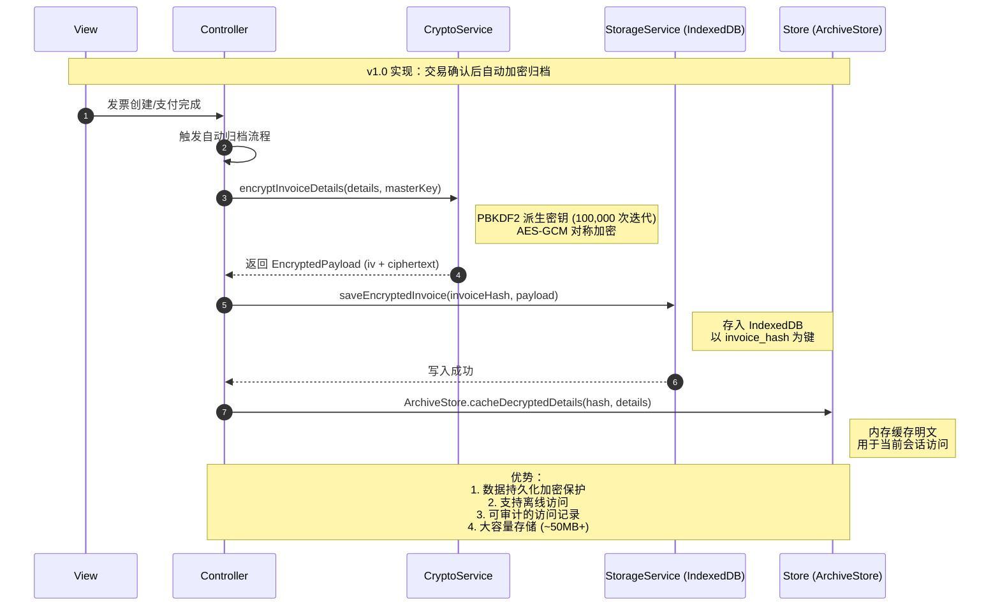
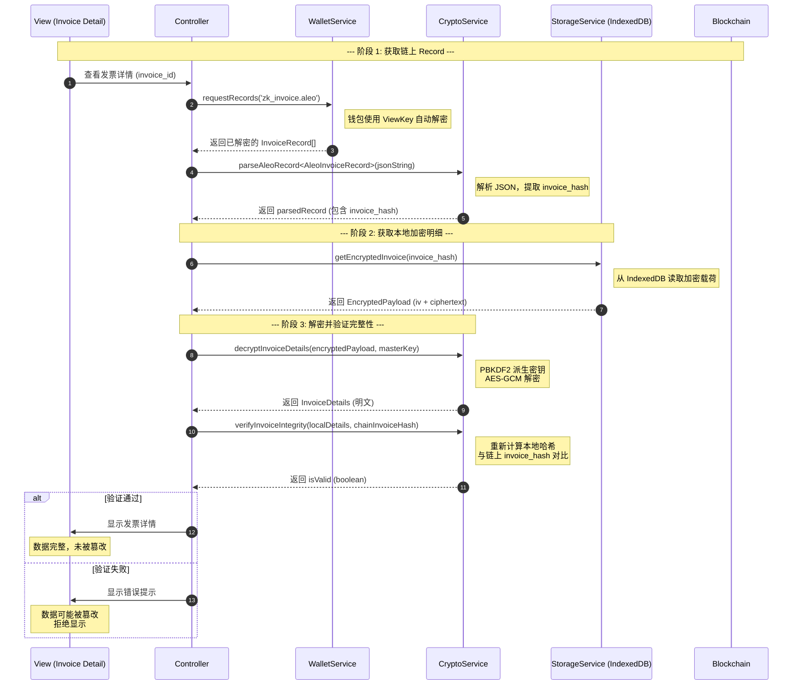
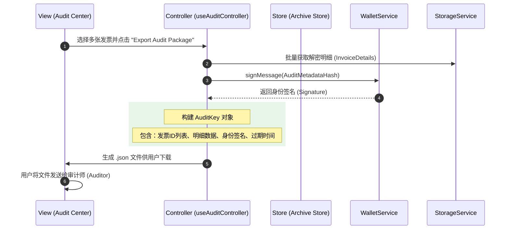
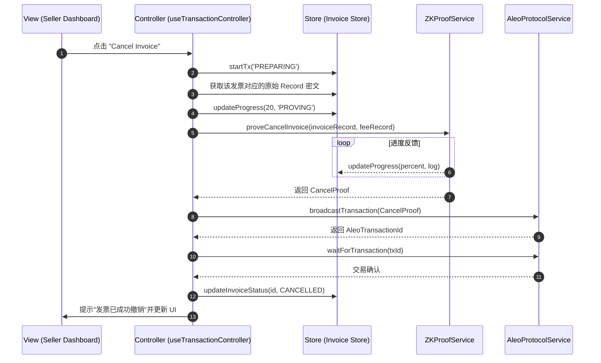

# Aleo 隐私发票系统：前端技术架构白皮书

## 1. 前端架构设计 (Architecture Design)

### 1.1 架构设计图



### 1.2 架构概述

本系统采用**四层解耦架构**，旨在将复杂的零知识证明（ZKP）计算、隐私数据管理与 UI 渲染完全分离，实现业务逻辑与 Aleo 底层协议的深度解耦。

---

## 2. 架构层级详细说明

### 2.1 View 层（视图层）

**职责**：负责 UI 渲染、用户交互、以及展示推导后的业务状态。

**核心特性**：
- 纯 React 组件，不处理业务逻辑
- 仅与 Controller 层交互
- 不直接读取 Store，也不直接调用 Aleo SDK

**典型组件**：
- Dashboard 仪表板
- 发票列表卡片
- 创建表单
- 进度条组件

---

### 2.2 Controller 层（逻辑控制层）

**职责**：系统的"指挥中心"。负责接收 View 的指令，协调 Service 进行计算，并根据结果更新 Model。

**核心功能**：

1. **状态推导**：从 Model 获取原始 Record 和 Mapping，推导出业务语义（如 `isPaid`、`canCancel`）
2. **流程控制**：管理异步交易生命周期（Pending → Mining → Confirmed）
3. **异常处理**：捕获 Service 层的底层错误，并转化为用户友好的提示传递给 View

**实现形式**：
- 以 Custom Hooks 形式存在
- 编排发票生命周期（创建 → 支付 → 归档）
- 处理错误弹窗

**交互对象**：
- 向上对接 View
- 向下对接 Service 和 Model

---

### 2.3 Service 层（服务适配层）

**职责**：负责所有"重型"和"底层"操作，是 Aleo 协议的适配器。

**核心功能**：

1. **Aleo SDK 交互**：封装 `requestRecords`、执行 `Transition`、生成 ZKP 证明
2. **加密算法**：执行发票明细的 AES 加密、Audit Key 的派生、SHA-256 哈希计算
3. **单位转换**：处理 Microcredits 与 Credits 之间的精度转换
4. **RPC 通信**：与 Aleo 节点进行网络通信

**核心服务**：
- 处理 Aleo SDK、WASM 调用
- 实现本地加解密与存储
- 管理本地持久化

**交互对象**：
- 被 Controller 调用
- 不直接操作 Model

---

### 2.4 Model 层（数据存储层）

**职责**：系统的数据源，管理全局状态，充当系统的"单一事实来源"。

**核心组成**：

1. **Zustand Store**：存储从链上同步回来的原始 Record 密文、Mapping 公开状态
2. **IndexedDB (Cache)**：本地持久化存储用户已解密的私密发票详情

**核心状态管理**：
- 维护用户信息
- 管理链上发票索引
- 存储本地解密档案
- 记录交易实时日志

**交互对象**：
- 被 Controller 读取或更新
- 为 Controller 提供推导原始数据

---

## 3. 各模块职责表 (Module Responsibility Matrix)

### 3.1 Controller 层 (Controllers)

| Hook 名 | 职责描述 | 接口定义 |
|---------|---------|---------|
| `useWalletController` | 处理钱包连接、余额轮询及身份授权 | [IWalletController.ts](../controller/Wallet/IWalletController.ts) |
| `useInvoiceController` | 处理发票列表的显示逻辑、解密触发 | [IInvoiceController.ts](../controller/Invoice/IInvoiceController.ts) |
| `useTransactionController` | 管理高耗时 ZKP 流程（创建/支付/撤销） | [ITxController.ts](../controller/Transaction/ITxController.ts) |
| `useAuditController` | 负责隐私数据的打包、签名与导出 | [IAuditController.ts](../controller/Audit/IAuditController.ts) |

### 3.2 Model 层 (Stores)

| Store 名 | 职责 | 接口定义 |
|---------|------|---------|
| `useUserStore` | 用户中心 | [UserState.ts](../stores/User/UserState.ts) |
| `useInvoiceStore` | 索引库 | [InvoiceState.ts](../stores/Invoice/InvoiceState.ts) |
| `useArchiveStore` | 档案库 | [ArchiveState.ts](../stores/Archive/ArchiveState.ts) |
| `useTransactionStore` | 任务站 | [TransactionState.ts](../stores/Transaction/TransactionState.ts) |

### 3.3 Service 层 (底层能力)

| 服务接口 | 职责描述 | 接口定义 | 实现状态 |
|---------|---------|---------|---------|
| **IWalletService** | 连接钱包、获取 ViewKey、获取余额、签名 | [IWalletService.ts](../services/WalletService/IWalletService.ts) | ✅ 完全实现 |
| **ICryptoService** | 计算发票哈希、本地加解密、Record 解析、完整性验证 | [ICryptoService.ts](../services/CryptoService/ICryptoService.ts) | ✅ 完全实现 |
| **IStorageService** | IndexedDB 的 CRUD，用于持久化数据 | [IStorageService.ts](../services/StorageService/IStorageService.ts) | ✅ 完全实现 |
| **IAleoProtocolService** | 节点 RPC 交互（广播交易、查询 Mapping、扫描高度） | [IAleoProtocolService.ts](../services/AleoProtocolService/IAleoProtocolService.ts) | ⚠️ 部分实现 |
| **IZKProofService** | 生成 ZKP 证明（未使用，钱包内部处理） | [IZKProofService.ts](../services/ZKProofService/IZKProofService.ts) | ⭕ 未使用 |

> ***ICryptoService 说明**:  
> - ✅ 已使用：`computeInvoiceHash` - 发票哈希计算（SHA-256 + 模运算）  
> - ✅ 已使用：`encryptInvoiceDetails` / `decryptInvoiceDetails` - 本地加密存储（PBKDF2 + AES-GCM）  
> - ✅ 已使用：`parseAleoRecord` - Record 数据解析（处理钱包已解密的数据）  
> - ✅ 已使用：`verifyInvoiceIntegrity` - 完整性验证（对比本地哈希与链上哈希）  
>
> **加密存储流程**：  
> v1.0 版本已完全实现加密存储功能。发票创建时，明细通过 `encryptInvoiceDetails` 加密后存入 IndexedDB，查看时通过 `decryptInvoiceDetails` 解密，并通过 `verifyInvoiceIntegrity` 验证数据完整性，确保数据未被篡改。

### 3.4 错误处理系统 (Error Handling System)

#### 3.4.1 架构图



#### 3.4.2 核心文件

| 文件 | 职责 | 路径 |
|------|------|------|
| **ServiceError** | Service 层通用错误基类（泛型） | [service-errors.ts](../lib/service-errors.ts) |
| **AppError** | UI 层用户友好错误类型 | [errors.ts](../lib/errors.ts) |
| **ErrorType** | 错误类型枚举（面向用户） | [errors.ts](../lib/errors.ts) |
| **toAppError** | 错误转换器（ServiceError → AppError） | [errors.ts](../lib/errors.ts) |
| **useErrorStore** | 错误状态管理 | [useErrorStore.ts](../stores/Error/useErrorStore.ts) |
| **useErrorHandler** | 错误处理 Controller | [useErrorHandler.ts](../controller/Error/useErrorHandler.ts) |
| **ErrorHandler** | 错误展示组件（Toast 触发） | [error-handler.tsx](../components/error-handler.tsx) |

#### 3.4.3 错误类型层级

```
┌─────────────────────────────────────────────────────────┐
│  Service Layer (技术错误)                                │
│  ├─ WalletServiceError<WalletError>                     │
│  │   ├─ NOT_INSTALLED                                   │
│  │   ├─ USER_REJECTED                                   │
│  │   ├─ INSUFFICIENT_FEE                                │
│  │   ├─ NETWORK_MISMATCH                                │
│  │   ├─ UNAUTHORIZED                                    │
│  │   └─ DECRYPTION_FAILED                               │
│  └─ ProtocolServiceError<ProtocolError>                 │
│      ├─ NODE_CONNECTION_FAILED                          │
│      ├─ INVALID_RECORD                                  │
│      ├─ TRANSACTION_REJECTED                            │
│      ├─ SYNC_TIMEOUT                                    │
│      └─ MAPPING_NOT_FOUND                               │
└─────────────────────────────────────────────────────────┘
                         ↓ toAppError()
┌─────────────────────────────────────────────────────────┐
│  UI Layer (用户友好错误)                                 │
│  AppError<ErrorType>                                    │
│  ├─ WALLET_NOT_CONNECTED     → "钱包未连接"              │
│  ├─ WALLET_CONNECTION_FAILED → "钱包连接失败"            │
│  ├─ TRANSACTION_REJECTED     → "交易已拒绝"              │
│  ├─ INSUFFICIENT_BALANCE     → "余额不足"                │
│  ├─ NETWORK_ERROR            → "网络错误"                │
│  └─ ...                                                 │
└─────────────────────────────────────────────────────────┘
```

#### 3.4.4 使用示例

```typescript
// Controller 层使用错误处理
const { handleError } = useErrorHandler();

const handleConnect = async () => {
  try {
    await walletService.connect();
    // 成功逻辑...
  } catch (error) {
    // 自动转换为用户友好提示并显示 Toast
    handleError(error);
  }
};
```

---

## 4. 关键业务的时序逻辑 (Sequence Diagrams)

### 4.1 连接钱包 (Connect Wallet)



### 4.2 开票 (Issue Invoice)



### 4.3 支付发票 (Pay Invoice)



### 4.4 数据存储策略 (Data Storage Strategy)

> **实现状态**: v1.0 版本采用 IndexedDB + 加密存储的完整方案，确保数据安全性和完整性。

#### 当前实现 (v1.0) - 加密归档流程



#### 数据安全特性

| 特性 | v1.0 实现 |
|------|----------|
| 存储位置 | ✅ IndexedDB |
| 数据加密 | ✅ AES-GCM 加密 |
| 密钥管理 | ✅ PBKDF2 派生 + 用户密钥 |
| 离线访问 | ✅ 支持 |
| 数据容量 | ✅ ~50MB+ |
| 完整性验证 | ✅ verifyInvoiceIntegrity |
| 审计追踪 | ✅ 访问记录 |

### 4.5 发票验证流程 (Invoice Verification)

> **核心功能**: 验证本地存储的发票明细与链上存证的完整性，防止数据篡改。



**验证流程说明**:
1. **链上存证**: 发票创建时，`invoice_hash` 存储在链上 `InvoiceRecord` 中，不可篡改
2. **本地加密存储**: 发票明细通过 `encryptInvoiceDetails` 加密后存入 IndexedDB
3. **完整性验证**: 查看发票时，重新计算本地明细的哈希，与链上哈希对比
4. **防篡改保护**: 如果本地数据被篡改，哈希不匹配，系统拒绝显示

### 4.6 审计导出 (Audit Export)



### 4.7 取消开票 (Cancel Invoice)



---

## 5. 架构设计原则

### 5.1 解耦原则

- **View 层**不直接调用底层 Service，业务逻辑通过 Service 层封装
- **View 层**通过 Service 层与钱包交互，不直接访问 `window.leoWallet`
- **Service 层**专注于业务逻辑封装，不包含 UI 相关代码
- **Store 层**负责状态管理，不直接调用钱包或区块链 API

### 5.2 持久化原则（当前实现）

> **v1.0 策略**: 采用 IndexedDB + 加密存储的完整方案

- **存储方案**：使用 `IndexedDB` 存储加密后的发票明细
- **加密方案**：所有敏感数据通过 `CryptoService` 加密后存储
  - 使用 PBKDF2 (100,000 次迭代) 派生用户密钥
  - AES-GCM 对称加密保护数据隐私
- **完整性验证**：通过 `verifyInvoiceIntegrity` 确保数据未被篡改
- **设计优势**：
  - ✅ 数据持久化加密保护
  - ✅ 支持离线访问
  - ✅ 大容量存储（~50MB+）
  - ✅ 可审计的访问记录
  - ✅ 防篡改机制

### 5.3 单一职责原则

- 每一层只负责其核心职责
- Controller 作为唯一的协调者，不包含具体的业务计算逻辑
- Service 层封装所有底层实现细节

### 5.4 错误处理原则

- **Service 层**抛出技术性错误（`WalletServiceError`、`ProtocolServiceError`）
- **Controller 层**使用 `useErrorHandler` 捕获并转换错误
- **View 层**通过 `ErrorHandler` 组件自动展示 Toast
- 错误类型分层：技术错误（Service）→ 用户友好错误（UI）
- 使用泛型基类 `ServiceError<T>` 消除重复代码

---

## 6. 实现状态与版本规划

### 6.1 当前实现状态 (v1.0)

#### ✅ 已完成功能

| 功能模块 | 实现状态 | 技术方案 |
|---------|---------|---------|
| **钱包连接** | ✅ 完全实现 | Leo Wallet 适配器 |
| **发票创建** | ✅ 完全实现 | 直接调用钱包 `requestTransaction` |
| **发票支付** | ✅ 完全实现 | 两步流程：转账 + 标记已支付 |
| **发票取消** | ✅ 完全实现 | 调用合约 `cancel_invoice` |
| **余额查询** | ✅ 完全实现 | 私有余额 + 公开余额 |
| **哈希计算** | ✅ 完全实现 | SHA-256 + 模运算（Field 范围） |
| **数据存储** | ✅ 完全实现 | IndexedDB + 加密存储 |
| **数据加密** | ✅ 完全实现 | PBKDF2 + AES-GCM |
| **完整性验证** | ✅ 完全实现 | verifyInvoiceIntegrity |
| **审计密钥** | ✅ 基础实现 | SHA-256 哈希生成 |
| **错误处理** | ✅ 完全实现 | ServiceError + AppError 分层 |

#### ⚠️ 部分实现功能

| 功能模块 | 当前状态 | 缺失部分 | 计划版本 |
|---------|---------|---------|---------|
| **审计导出** | ⚠️ 基础功能 | 钱包签名、文件导出 | v2.0 |
| **Record 解密** | ⚠️ 简化实现 | 依赖钱包自动解密 | - |
| **交易监控** | ⚠️ 基础实现 | 实时进度反馈 | v2.0 |

#### ❌ 未实现功能

| 功能模块 | 原因 | 计划版本 |
|---------|-----|---------|
| **ZKProofService** | 钱包内部已处理证明生成 | 不需要 |

### 6.2 技术架构决策

#### 决策 1: 不使用独立的 ZKProofService

**原因**:
- Leo Wallet 的 `requestTransaction` 已内置 ZKP 生成
- 无需重复封装，减少代码复杂度
- 钱包可以更好地管理证明生成过程

**影响**:
- ✅ 简化了架构
- ✅ 提高了开发效率
- ⚠️ 依赖钱包实现（但这是必然的）

#### 决策 2: v1.0 使用 IndexedDB + 加密存储

**原因**:
- 生产环境需要数据安全保护
- 支持大容量存储需求
- 提供完整性验证机制
- 符合隐私保护最佳实践

**影响**:
- ✅ 数据安全性高
- ✅ 支持离线访问
- ✅ 防篡改保护
- ✅ 可审计追踪
- ⚠️ 需要密钥管理（通过 PBKDF2 派生）

#### 决策 3: 完整的验证流程

**原因**:
- 确保本地数据与链上存证一致
- 防止数据被恶意篡改
- 提供用户信任保障

**实现**:
- ✅ `computeInvoiceHash` 计算哈希
- ✅ `verifyInvoiceIntegrity` 验证完整性
- ✅ 链上存证 + 本地加密存储双重保护

### 6.3 版本规划

#### v1.0 (当前版本)
- ✅ 核心业务流程完整
- ✅ IndexedDB + 加密存储
- ✅ 完整性验证机制
- ✅ 钱包集成完整
- ✅ 生产环境就绪

#### v2.0 (规划中)
- 🎯 完善审计导出（钱包签名、JSON/PDF 导出）
- 🎯 实时交易进度反馈
- 🎯 增强的密钥管理（用户特定盐值）
- 🎯 批量操作优化

#### v3.0 (远期规划)
- 🔮 多钱包支持
- 🔮 批量操作
- 🔮 高级审计功能
- 🔮 数据同步和备份

---

## 7. 版本信息

- **文档版本**: v1.3
- **代码版本**: v1.0
- **最后更新**: 2026-01-13
- **更新内容**: 
  - 更新数据存储策略：v1.0 使用 IndexedDB + 加密存储
  - 添加发票验证流程（完整性验证）
  - 更新开票流程时序图（包含加密归档）
  - 修正实现状态表（数据加密和存储已完全实现）
  - 更新技术架构决策（反映实际实现）
- **维护团队**: Aleo Privacy Invoice System Team