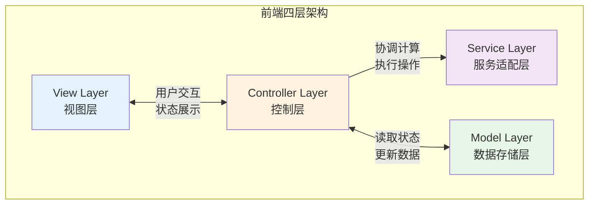
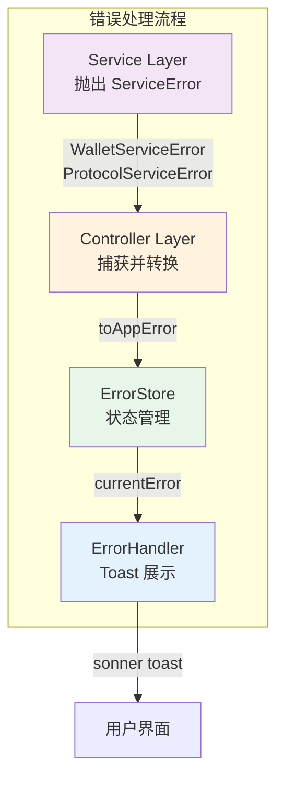
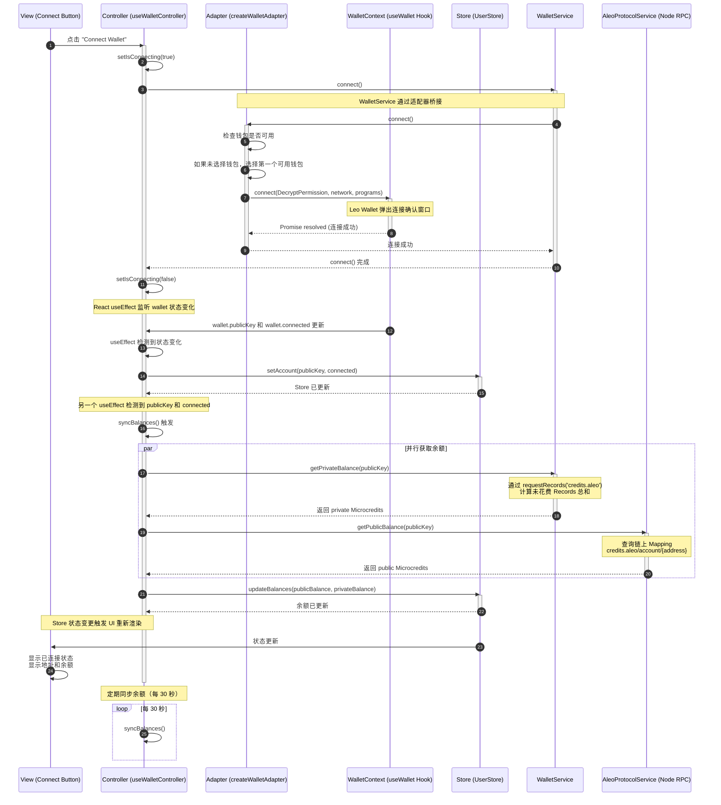
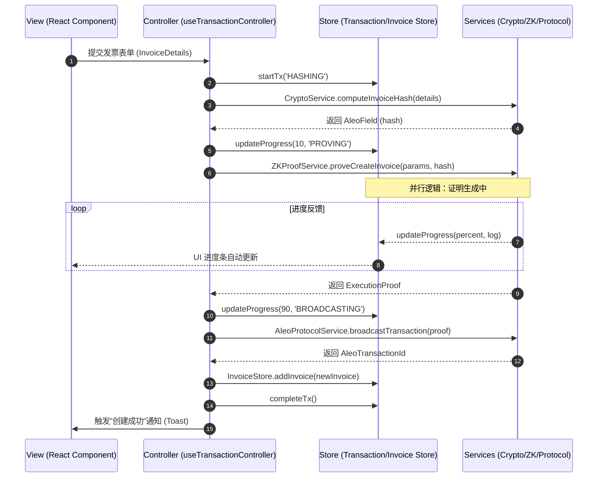
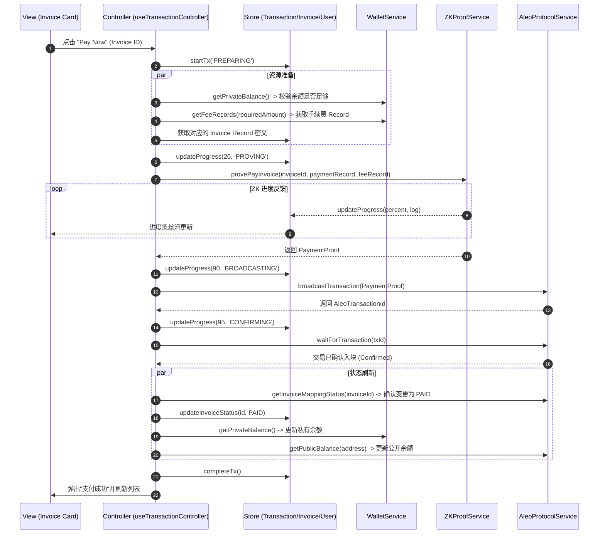
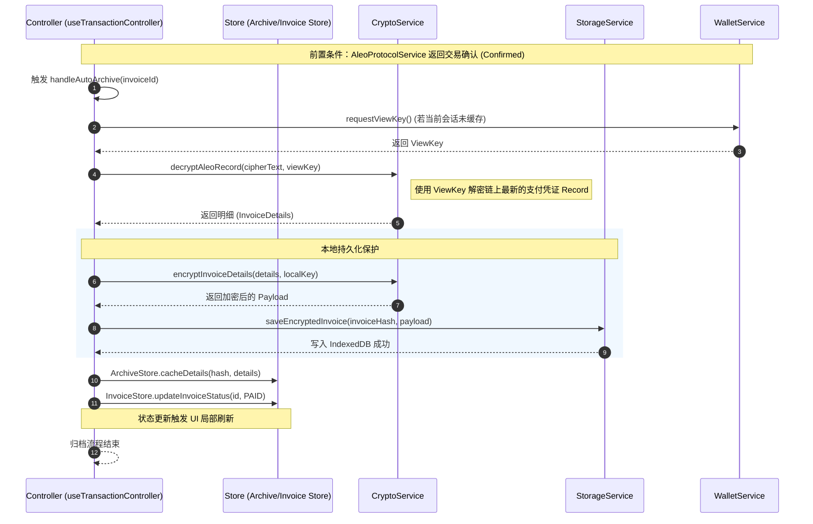
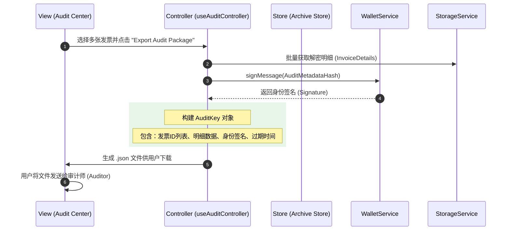
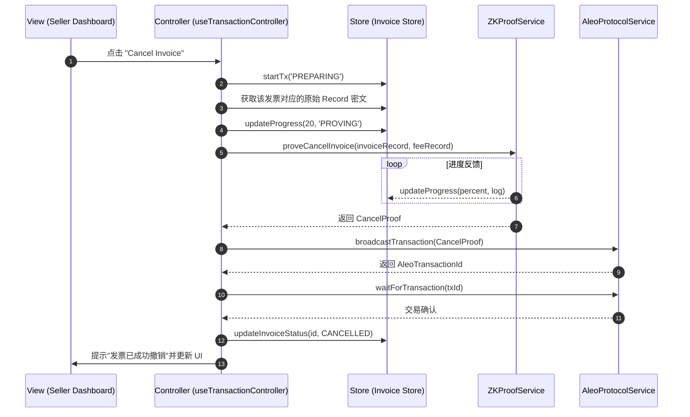

# Aleo 隐私发票系统：前端技术架构白皮书

## 1. 前端架构设计 (Architecture Design)

### 1.1 架构设计图



### 1.2 架构概述

本系统采用**四层解耦架构**，旨在将复杂的零知识证明（ZKP）计算、隐私数据管理与 UI 渲染完全分离，实现业务逻辑与 Aleo 底层协议的深度解耦。

---

## 2. 架构层级详细说明

### 2.1 View 层（视图层）

**职责**：负责 UI 渲染、用户交互、以及展示推导后的业务状态。

**核心特性**：
- 纯 React 组件，不处理业务逻辑
- 仅与 Controller 层交互
- 不直接读取 Store，也不直接调用 Aleo SDK

**典型组件**：
- Dashboard 仪表板
- 发票列表卡片
- 创建表单
- 进度条组件

---

### 2.2 Controller 层（逻辑控制层）

**职责**：系统的"指挥中心"。负责接收 View 的指令，协调 Service 进行计算，并根据结果更新 Model。

**核心功能**：

1. **状态推导**：从 Model 获取原始 Record 和 Mapping，推导出业务语义（如 `isPaid`、`canCancel`）
2. **流程控制**：管理异步交易生命周期（Pending → Mining → Confirmed）
3. **异常处理**：捕获 Service 层的底层错误，并转化为用户友好的提示传递给 View

**实现形式**：
- 以 Custom Hooks 形式存在
- 编排发票生命周期（创建 → 支付 → 归档）
- 处理错误弹窗

**交互对象**：
- 向上对接 View
- 向下对接 Service 和 Model

---

### 2.3 Service 层（服务适配层）

**职责**：负责所有"重型"和"底层"操作，是 Aleo 协议的适配器。

**核心功能**：

1. **Aleo SDK 交互**：封装 `requestRecords`、执行 `Transition`、生成 ZKP 证明
2. **加密算法**：执行发票明细的 AES 加密、Audit Key 的派生、SHA-256 哈希计算
3. **单位转换**：处理 Microcredits 与 Credits 之间的精度转换
4. **RPC 通信**：与 Aleo 节点进行网络通信

**核心服务**：
- 处理 Aleo SDK、WASM 调用
- 实现本地加解密与存储
- 管理本地持久化

**交互对象**：
- 被 Controller 调用
- 不直接操作 Model

---

### 2.4 Model 层（数据存储层）

**职责**：系统的数据源，管理全局状态，充当系统的"单一事实来源"。

**核心组成**：

1. **Zustand Store**：存储从链上同步回来的原始 Record 密文、Mapping 公开状态
2. **IndexedDB (Cache)**：本地持久化存储用户已解密的私密发票详情

**核心状态管理**：
- 维护用户信息
- 管理链上发票索引
- 存储本地解密档案
- 记录交易实时日志

**交互对象**：
- 被 Controller 读取或更新
- 为 Controller 提供推导原始数据

---

## 3. 各模块职责表 (Module Responsibility Matrix)

### 3.1 Controller 层 (Controllers)

| Hook 名 | 职责描述 | 接口定义 |
|---------|---------|---------|
| `useWalletController` | 处理钱包连接、余额轮询及身份授权 | [IWalletController.ts](../controller/Wallet/IWalletController.ts) |
| `useInvoiceController` | 处理发票列表的显示逻辑、解密触发 | [IInvoiceController.ts](../controller/Invoice/IInvoiceController.ts) |
| `useTransactionController` | 管理高耗时 ZKP 流程（创建/支付/撤销） | [ITxController.ts](../controller/Transaction/ITxController.ts) |
| `useAuditController` | 负责隐私数据的打包、签名与导出 | [IAuditController.ts](../controller/Audit/IAuditController.ts) |

### 3.2 Model 层 (Stores)

| Store 名 | 职责 | 接口定义 |
|---------|------|---------|
| `useUserStore` | 用户中心 | [UserState.ts](../stores/User/UserState.ts) |
| `useInvoiceStore` | 索引库 | [InvoiceState.ts](../stores/Invoice/InvoiceState.ts) |
| `useArchiveStore` | 档案库 | [ArchiveState.ts](../stores/Archive/ArchiveState.ts) |
| `useTransactionStore` | 任务站 | [TransactionState.ts](../stores/Transaction/TransactionState.ts) |

### 3.3 Service 层 (底层能力)

| 服务接口 | 职责描述 | 接口定义 |
|---------|---------|---------|
| **IWalletService** | 连接钱包、获取 ViewKey、获取余额、签名 | [IWalletService.ts](../services/WalletService/IWalletService.ts) |
| **IZKProofService** | 生成 `create_invoice`、`pay_invoice`、`cancel_invoice` 的证明 | [IZKProofService.ts](../services/ZKProofService/IZKProofService.ts) |
| **ICryptoService** | 计算 BHP256 哈希、本地明文加解密、Record 解密 | [ICryptoService.ts](../services/CryptoService/ICryptoService.ts) |
| **IStorageService** | IndexedDB 的 CRUD，用于持久化加密后的 Archive 数据 | [IStorageService.ts](../services/StorageService/IStorageService.ts) |
| **IAleoProtocolService** | 节点 RPC 交互（广播交易、查询 Mapping、扫描高度） | [IAleoProtocolService.ts](../services/AleoProtocolService/IAleoProtocolService.ts) |

### 3.4 错误处理系统 (Error Handling System)

#### 3.4.1 架构图



#### 3.4.2 核心文件

| 文件 | 职责 | 路径 |
|------|------|------|
| **ServiceError** | Service 层通用错误基类（泛型） | [service-errors.ts](../lib/service-errors.ts) |
| **AppError** | UI 层用户友好错误类型 | [errors.ts](../lib/errors.ts) |
| **ErrorType** | 错误类型枚举（面向用户） | [errors.ts](../lib/errors.ts) |
| **toAppError** | 错误转换器（ServiceError → AppError） | [errors.ts](../lib/errors.ts) |
| **useErrorStore** | 错误状态管理 | [useErrorStore.ts](../stores/Error/useErrorStore.ts) |
| **useErrorHandler** | 错误处理 Controller | [useErrorHandler.ts](../controller/Error/useErrorHandler.ts) |
| **ErrorHandler** | 错误展示组件（Toast 触发） | [error-handler.tsx](../components/error-handler.tsx) |

#### 3.4.3 错误类型层级

```
┌─────────────────────────────────────────────────────────┐
│  Service Layer (技术错误)                                │
│  ├─ WalletServiceError<WalletError>                     │
│  │   ├─ NOT_INSTALLED                                   │
│  │   ├─ USER_REJECTED                                   │
│  │   ├─ INSUFFICIENT_FEE                                │
│  │   ├─ NETWORK_MISMATCH                                │
│  │   ├─ UNAUTHORIZED                                    │
│  │   └─ DECRYPTION_FAILED                               │
│  └─ ProtocolServiceError<ProtocolError>                 │
│      ├─ NODE_CONNECTION_FAILED                          │
│      ├─ INVALID_RECORD                                  │
│      ├─ TRANSACTION_REJECTED                            │
│      ├─ SYNC_TIMEOUT                                    │
│      └─ MAPPING_NOT_FOUND                               │
└─────────────────────────────────────────────────────────┘
                         ↓ toAppError()
┌─────────────────────────────────────────────────────────┐
│  UI Layer (用户友好错误)                                 │
│  AppError<ErrorType>                                    │
│  ├─ WALLET_NOT_CONNECTED     → "钱包未连接"              │
│  ├─ WALLET_CONNECTION_FAILED → "钱包连接失败"            │
│  ├─ TRANSACTION_REJECTED     → "交易已拒绝"              │
│  ├─ INSUFFICIENT_BALANCE     → "余额不足"                │
│  ├─ NETWORK_ERROR            → "网络错误"                │
│  └─ ...                                                 │
└─────────────────────────────────────────────────────────┘
```

#### 3.4.4 使用示例

```typescript
// Controller 层使用错误处理
const { handleError } = useErrorHandler();

const handleConnect = async () => {
  try {
    await walletService.connect();
    // 成功逻辑...
  } catch (error) {
    // 自动转换为用户友好提示并显示 Toast
    handleError(error);
  }
};
```

---

## 4. 关键业务的时序逻辑 (Sequence Diagrams)

### 4.1 连接钱包 (Connect Wallet)



### 4.2 开票 (Issue Invoice)



### 4.3 支付发票 (Pay Invoice)



### 4.4 自动化归档 (Automated Archiving)



### 4.5 审计导出 (Audit Export)



### 4.6 取消开票 (Cancel Invoice)



---

## 5. 架构设计原则

### 5.1 解耦原则

- **View 层**禁止直接调用 `ZKProofService`，必须通过 Controller 驱动 `TransactionStore`
- **View 层**不直接读取 Store，所有状态通过 Controller 传递
- **Service 层**不直接操作 Model，所有状态更新由 Controller 协调

### 5.2 持久化原则

- 所有解密后的数据必须通过 `StorageService` 进入 `useArchiveStore`
- 敏感数据在本地存储前必须经过加密处理
- IndexedDB 作为持久化缓存，提升用户体验

### 5.3 单一职责原则

- 每一层只负责其核心职责
- Controller 作为唯一的协调者，不包含具体的业务计算逻辑
- Service 层封装所有底层实现细节

### 5.4 错误处理原则

- **Service 层**抛出技术性错误（`WalletServiceError`、`ProtocolServiceError`）
- **Controller 层**使用 `useErrorHandler` 捕获并转换错误
- **View 层**通过 `ErrorHandler` 组件自动展示 Toast
- 错误类型分层：技术错误（Service）→ 用户友好错误（UI）
- 使用泛型基类 `ServiceError<T>` 消除重复代码

---

## 6. 版本信息

- **文档版本**: v1.1
- **最后更新**: 2026-01
- **维护团队**: Aleo Privacy Invoice System Team