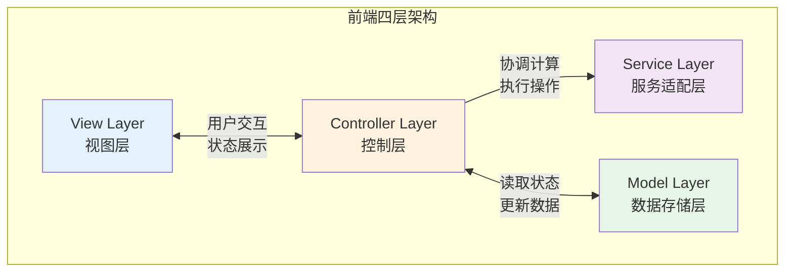
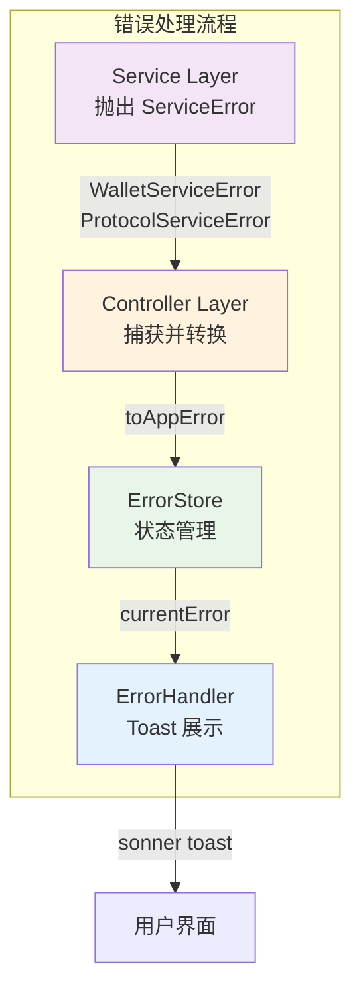
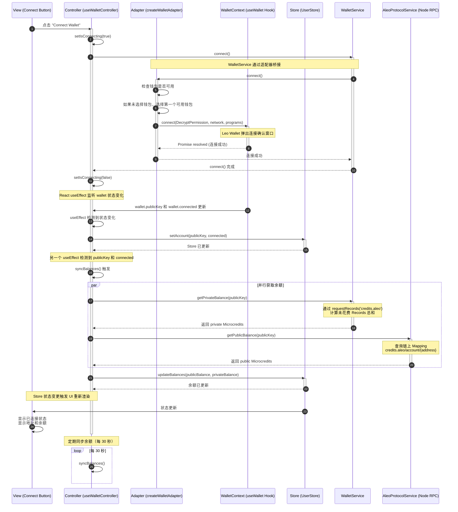
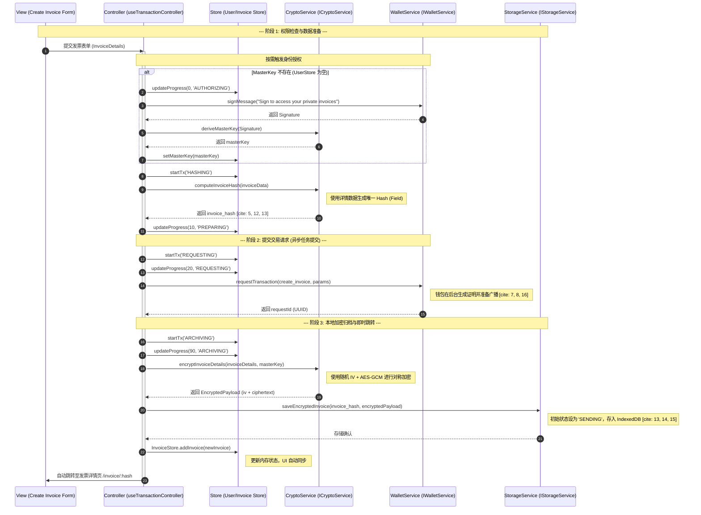
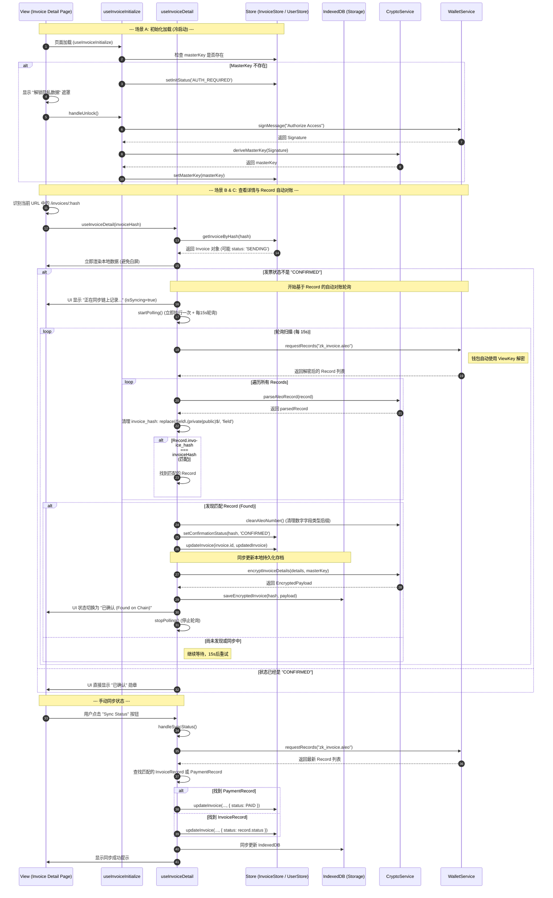
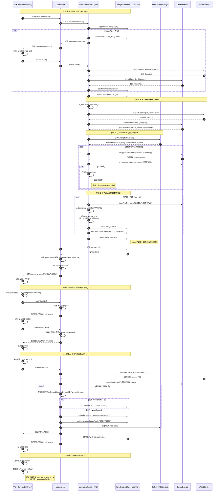
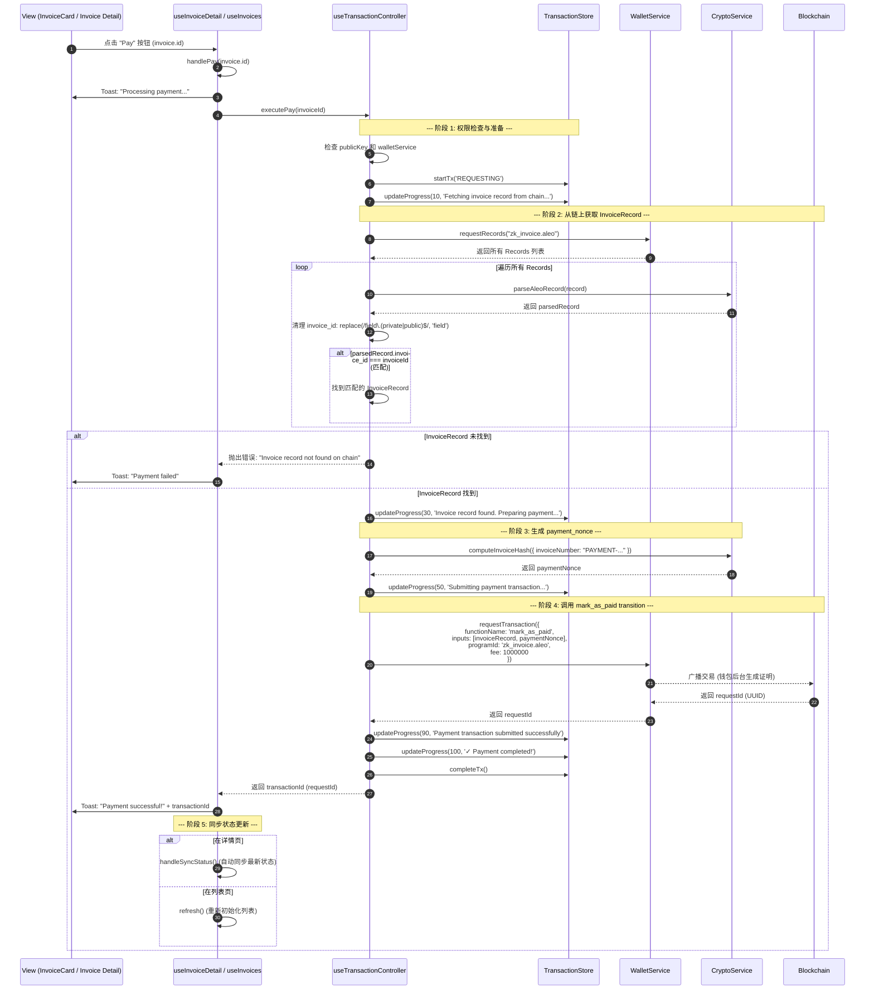
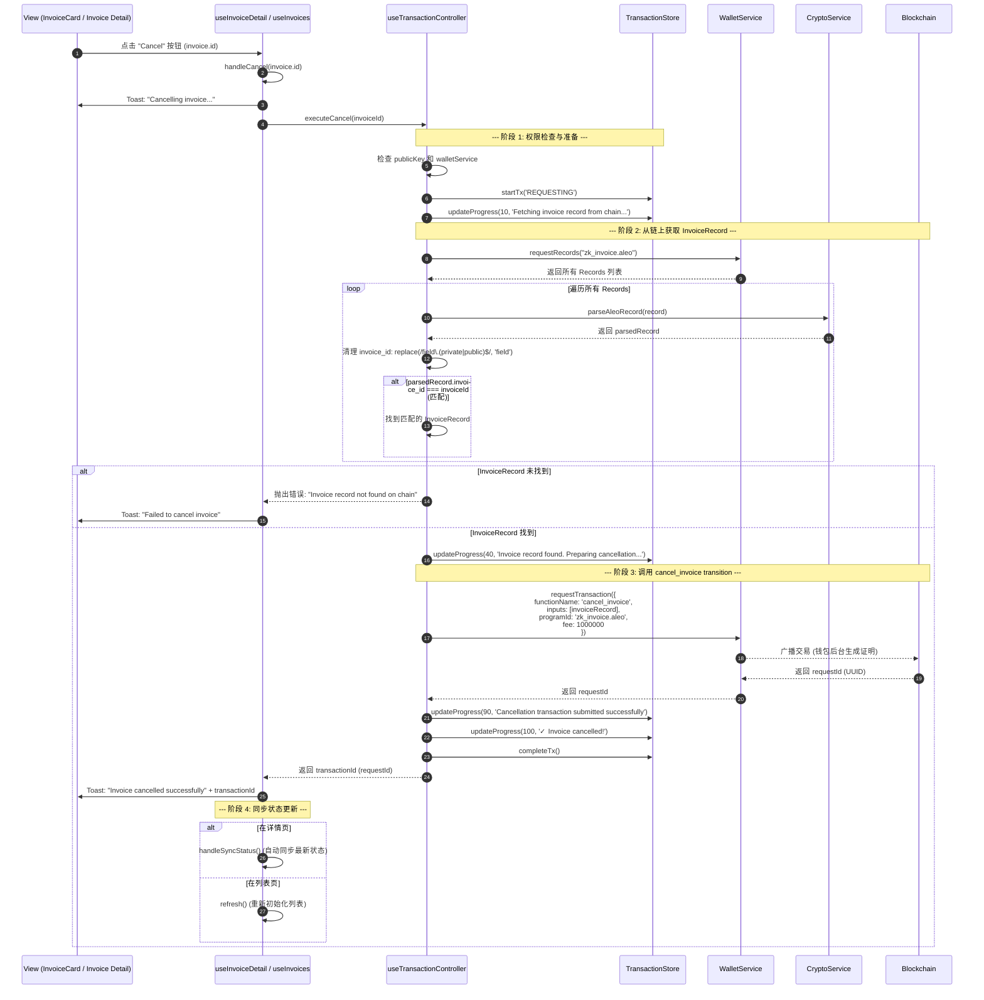
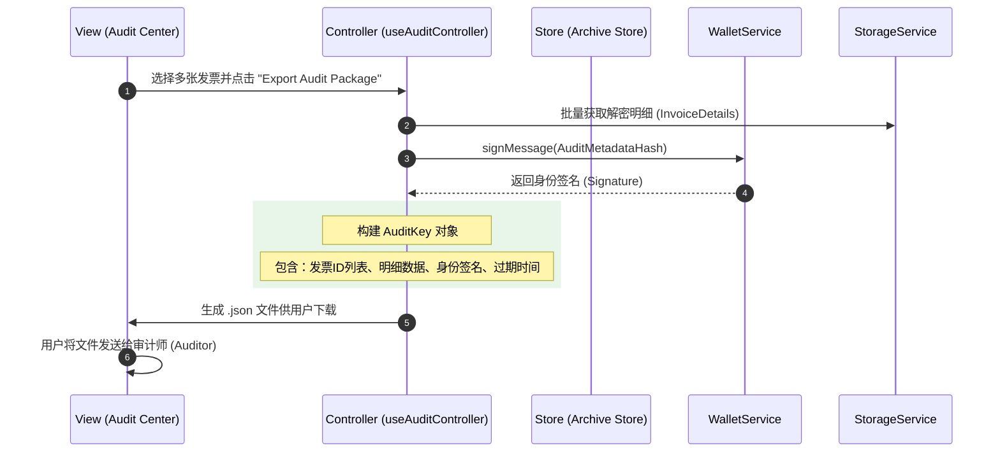

# Aleo 隐私发票系统：前端技术架构白皮书

## 1. 前端架构设计 (Architecture Design)

### 1.1 架构设计图



### 1.2 架构概述

本系统采用**四层解耦架构**，旨在将隐私数据管理与 UI 渲染完全分离，实现业务逻辑与 Aleo 底层协议的深度解耦。零知识证明（ZKP）的生成由钱包内部处理，应用层通过 `WalletService` 与钱包交互。

---

## 2. 架构层级详细说明

### 2.1 View 层（视图层）

**职责**：负责 UI 渲染、用户交互、以及展示推导后的业务状态。

**核心特性**：
- 纯 React 组件，不处理业务逻辑
- 仅与 Controller 层交互
- 不直接读取 Store，也不直接调用 Aleo SDK

**典型组件**：
- Dashboard 仪表板
- 发票列表卡片
- 创建表单
- 进度条组件

---

### 2.2 Controller 层（逻辑控制层）

**职责**：系统的"指挥中心"。负责接收 View 的指令，协调 Service 进行计算，并根据结果更新 Model。

**核心功能**：

1. **状态推导**：从 Model 获取原始 Record 和 Mapping，推导出业务语义（如 `isPaid`、`canCancel`）
2. **流程控制**：管理异步交易生命周期（Pending → Mining → Confirmed）
3. **异常处理**：捕获 Service 层的底层错误，并转化为用户友好的提示传递给 View

**实现形式**：
- 以 Custom Hooks 形式存在
- 编排发票生命周期（创建 → 支付 → 归档）
- 处理错误弹窗

**交互对象**：
- 向上对接 View
- 向下对接 Service 和 Model

---

### 2.3 Service 层（服务适配层）

**职责**：负责所有"重型"和"底层"操作，是 Aleo 协议的适配器。

**核心功能**：

1. **钱包交互**：封装 `requestRecords`、`requestTransaction`，与钱包进行交互（ZKP 证明由钱包内部生成）
2. **加密算法**：执行发票明细的 AES 加密、Audit Key 的派生、SHA-256 哈希计算
3. **单位转换**：处理 Microcredits 与 Credits 之间的精度转换
4. **RPC 通信**：与 Aleo 节点进行网络通信

**核心服务**：
- 处理 Aleo SDK、WASM 调用
- 实现本地加解密与存储
- 管理本地持久化

**交互对象**：
- 被 Controller 调用
- 不直接操作 Model

---

### 2.4 Model 层（数据存储层）

**职责**：系统的数据源，管理全局状态，充当系统的"单一事实来源"。

**核心组成**：

1. **Zustand Store**：存储从链上同步回来的原始 Record 密文、Mapping 公开状态
2. **IndexedDB (Cache)**：本地持久化存储用户已解密的私密发票详情

**核心状态管理**：
- 维护用户信息
- 管理链上发票索引
- 存储本地解密档案
- 记录交易实时日志

**交互对象**：
- 被 Controller 读取或更新
- 为 Controller 提供推导原始数据

---

## 3. 各模块职责表 (Module Responsibility Matrix)

### 3.1 Controller 层 (Controllers)

| Hook 名 | 职责描述 | 接口定义 |
|---------|---------|---------|
| `useWalletController` | 处理钱包连接、余额轮询及身份授权 | [IWalletController.ts](../controller/Wallet/IWalletController.ts) |
| `useInvoiceController` | 处理发票列表的显示逻辑、解密触发 | [IInvoiceController.ts](../controller/Invoice/IInvoiceController.ts) |
| `useTransactionController` | 管理交易流程（创建/支付/撤销），通过钱包服务处理链上交互 | [ITxController.ts](../controller/Transaction/ITxController.ts) |
| `useAuditController` | 负责隐私数据的打包、签名与导出 | [IAuditController.ts](../controller/Audit/IAuditController.ts) |

### 3.2 Model 层 (Stores)

| Store 名 | 职责 | 接口定义 |
|---------|------|---------|
| `useUserStore` | 用户中心 | [UserState.ts](../stores/User/UserState.ts) |
| `useInvoiceStore` | 索引库 | [InvoiceState.ts](../stores/Invoice/InvoiceState.ts) |
| `useArchiveStore` | 档案库 | [ArchiveState.ts](../stores/Archive/ArchiveState.ts) |
| `useTransactionStore` | 任务站 | [TransactionState.ts](../stores/Transaction/TransactionState.ts) |

### 3.3 Service 层 (底层能力)

| 服务接口 | 职责描述 | 接口定义 | 实现状态 |
|---------|---------|---------|---------|
| **IWalletService** | 连接钱包、获取 ViewKey、获取余额、签名、请求交易 | [IWalletService.ts](../services/WalletService/IWalletService.ts) | ✅ 完全实现 |
| **ICryptoService** | 计算发票哈希、本地加解密、Record 解析、完整性验证 | [ICryptoService.ts](../services/CryptoService/ICryptoService.ts) | ✅ 完全实现 |
| **IStorageService** | IndexedDB 的 CRUD，用于持久化数据 | [IStorageService.ts](../services/StorageService/IStorageService.ts) | ✅ 完全实现 |
| **IAleoProtocolService** | 节点 RPC 交互（广播交易、查询 Mapping、扫描高度） | [IAleoProtocolService.ts](../services/AleoProtocolService/IAleoProtocolService.ts) | ⚠️ 部分实现 |

> **说明**: 零知识证明（ZKP）的生成由 Leo Wallet 内部处理，应用层通过 `WalletService.requestTransaction` 调用钱包功能，钱包会自动生成证明并广播交易。

> ***ICryptoService 说明**:  
> - ✅ 已使用：`computeInvoiceHash` - 发票哈希计算（SHA-256 + 模运算）  
> - ✅ 已使用：`encryptInvoiceDetails` / `decryptInvoiceDetails` - 本地加密存储（PBKDF2 + AES-GCM）  
> - ✅ 已使用：`parseAleoRecord` - Record 数据解析（处理钱包已解密的数据）  
> - ✅ 已使用：`verifyInvoiceIntegrity` - 完整性验证（对比本地哈希与链上哈希）  
>
> **加密存储流程**：  
> v1.0 版本已完全实现加密存储功能。发票创建时，明细通过 `encryptInvoiceDetails` 加密后存入 IndexedDB，查看时通过 `decryptInvoiceDetails` 解密，并通过 `verifyInvoiceIntegrity` 验证数据完整性，确保数据未被篡改。

### 3.4 错误处理系统 (Error Handling System)

#### 3.4.1 架构图



#### 3.4.2 核心文件

| 文件 | 职责 | 路径 |
|------|------|------|
| **ServiceError** | Service 层通用错误基类（泛型） | [service-errors.ts](../lib/service-errors.ts) |
| **AppError** | UI 层用户友好错误类型 | [errors.ts](../lib/errors.ts) |
| **ErrorType** | 错误类型枚举（面向用户） | [errors.ts](../lib/errors.ts) |
| **toAppError** | 错误转换器（ServiceError → AppError） | [errors.ts](../lib/errors.ts) |
| **useErrorStore** | 错误状态管理 | [useErrorStore.ts](../stores/Error/useErrorStore.ts) |
| **useErrorHandler** | 错误处理 Controller | [useErrorHandler.ts](../controller/Error/useErrorHandler.ts) |
| **ErrorHandler** | 错误展示组件（Toast 触发） | [error-handler.tsx](../components/error-handler.tsx) |

#### 3.4.3 错误类型层级

```
┌─────────────────────────────────────────────────────────┐
│  Service Layer (技术错误)                                │
│  ├─ WalletServiceError<WalletError>                     │
│  │   ├─ NOT_INSTALLED                                   │
│  │   ├─ USER_REJECTED                                   │
│  │   ├─ INSUFFICIENT_FEE                                │
│  │   ├─ NETWORK_MISMATCH                                │
│  │   ├─ UNAUTHORIZED                                    │
│  │   └─ DECRYPTION_FAILED                               │
│  └─ ProtocolServiceError<ProtocolError>                 │
│      ├─ NODE_CONNECTION_FAILED                          │
│      ├─ INVALID_RECORD                                  │
│      ├─ TRANSACTION_REJECTED                            │
│      ├─ SYNC_TIMEOUT                                    │
│      └─ MAPPING_NOT_FOUND                               │
└─────────────────────────────────────────────────────────┘
                         ↓ toAppError()
┌─────────────────────────────────────────────────────────┐
│  UI Layer (用户友好错误)                                 │
│  AppError<ErrorType>                                    │
│  ├─ WALLET_NOT_CONNECTED     → "钱包未连接"              │
│  ├─ WALLET_CONNECTION_FAILED → "钱包连接失败"            │
│  ├─ TRANSACTION_REJECTED     → "交易已拒绝"              │
│  ├─ INSUFFICIENT_BALANCE     → "余额不足"                │
│  ├─ NETWORK_ERROR            → "网络错误"                │
│  └─ ...                                                 │
└─────────────────────────────────────────────────────────┘
```

#### 3.4.4 使用示例

```typescript
// Controller 层使用错误处理
const { handleError } = useErrorHandler();

const handleConnect = async () => {
  try {
    await walletService.connect();
    // 成功逻辑...
  } catch (error) {
    // 自动转换为用户友好提示并显示 Toast
    handleError(error);
  }
};
```

---

## 4. 关键业务的时序逻辑 (Sequence Diagrams)

### 4.1 连接钱包 (Connect Wallet)



### 4.2 开票 (Issue Invoice)



### 4.3 查看发票(View Invoice)

#### 4.3.1 查看发票详情页


#### 4.3.2 发票列表页查看


### 4.4 支付发票 (Pay Invoice)


### 4.5 取消发票 (Cancel Invoice)



### 4.6 审计导出 (Audit Export)




---

## 5. 架构设计原则

### 5.1 解耦原则

- **View 层**不直接调用底层 Service，业务逻辑通过 Service 层封装
- **View 层**通过 Service 层与钱包交互，不直接访问 `window.leoWallet`
- **Service 层**专注于业务逻辑封装，不包含 UI 相关代码
- **Store 层**负责状态管理，不直接调用钱包或区块链 API

### 5.2 持久化原则（当前实现）

> **v1.0 策略**: 采用 IndexedDB + 加密存储的完整方案

- **存储方案**：使用 `IndexedDB` 存储加密后的发票明细
- **加密方案**：所有敏感数据通过 `CryptoService` 加密后存储
  - 使用 PBKDF2 (100,000 次迭代) 派生用户密钥
  - AES-GCM 对称加密保护数据隐私
- **完整性验证**：通过 `verifyInvoiceIntegrity` 确保数据未被篡改
- **设计优势**：
  - ✅ 数据持久化加密保护
  - ✅ 支持离线访问
  - ✅ 大容量存储（~50MB+）
  - ✅ 可审计的访问记录
  - ✅ 防篡改机制

### 5.3 单一职责原则

- 每一层只负责其核心职责
- Controller 作为唯一的协调者，不包含具体的业务计算逻辑
- Service 层封装所有底层实现细节

### 5.4 错误处理原则

- **Service 层**抛出技术性错误（`WalletServiceError`、`ProtocolServiceError`）
- **Controller 层**使用 `useErrorHandler` 捕获并转换错误
- **View 层**通过 `ErrorHandler` 组件自动展示 Toast
- 错误类型分层：技术错误（Service）→ 用户友好错误（UI）
- 使用泛型基类 `ServiceError<T>` 消除重复代码

---

## 6. 实现状态与版本规划

### 6.1 当前实现状态 (v1.0)

#### ✅ 已完成功能

| 功能模块 | 实现状态 | 技术方案 |
|---------|---------|---------|
| **钱包连接** | ✅ 完全实现 | Leo Wallet 适配器 |
| **发票创建** | ✅ 完全实现 | 直接调用钱包 `requestTransaction` |
| **发票支付** | ✅ 完全实现 | 两步流程：转账 + 标记已支付 |
| **发票取消** | ✅ 完全实现 | 调用合约 `cancel_invoice` |
| **余额查询** | ✅ 完全实现 | 私有余额 + 公开余额 |
| **哈希计算** | ✅ 完全实现 | SHA-256 + 模运算（Field 范围） |
| **数据存储** | ✅ 完全实现 | IndexedDB + 加密存储 |
| **数据加密** | ✅ 完全实现 | PBKDF2 + AES-GCM |
| **完整性验证** | ✅ 完全实现 | verifyInvoiceIntegrity |
| **审计密钥** | ✅ 基础实现 | SHA-256 哈希生成 |
| **错误处理** | ✅ 完全实现 | ServiceError + AppError 分层 |

#### ⚠️ 部分实现功能

| 功能模块 | 当前状态 | 缺失部分 | 计划版本 |
|---------|---------|---------|---------|
| **审计导出** | ⚠️ 基础功能 | 钱包签名、文件导出 | v2.0 |
| **Record 解密** | ⚠️ 简化实现 | 依赖钱包自动解密 | - |
| **交易监控** | ⚠️ 基础实现 | 实时进度反馈 | v2.0 |

### 6.2 技术架构决策

#### 决策 1: 钱包处理 ZKP 生成

**原因**:
- Leo Wallet 的 `requestTransaction` 已内置零知识证明生成
- 无需应用层重复实现，减少代码复杂度
- 钱包可以更好地管理证明生成过程和性能优化

**实现**:
- 应用层通过 `WalletService.requestTransaction` 调用钱包功能
- 钱包自动生成证明并广播交易
- 应用层只关注业务逻辑，不处理底层证明生成

**影响**:
- ✅ 简化了架构（无需独立的 ZKProofService）
- ✅ 提高了开发效率
- ✅ 减少了维护成本
- ⚠️ 依赖钱包实现（但这是必然的，符合 Aleo 生态最佳实践）

#### 决策 2: v1.0 使用 IndexedDB + 加密存储

**原因**:
- 生产环境需要数据安全保护
- 支持大容量存储需求
- 提供完整性验证机制
- 符合隐私保护最佳实践

**影响**:
- ✅ 数据安全性高
- ✅ 支持离线访问
- ✅ 防篡改保护
- ✅ 可审计追踪
- ⚠️ 需要密钥管理（通过 PBKDF2 派生）

#### 决策 3: 完整的验证流程

**原因**:
- 确保本地数据与链上存证一致
- 防止数据被恶意篡改
- 提供用户信任保障

**实现**:
- ✅ `computeInvoiceHash` 计算哈希
- ✅ `verifyInvoiceIntegrity` 验证完整性
- ✅ 链上存证 + 本地加密存储双重保护

### 6.3 版本规划

#### v1.0 (当前版本)
- ✅ 核心业务流程完整
- ✅ IndexedDB + 加密存储
- ✅ 完整性验证机制
- ✅ 钱包集成完整
- ✅ 生产环境就绪

#### v2.0 (规划中)
- 🎯 完善审计导出（钱包签名、JSON/PDF 导出）
- 🎯 实时交易进度反馈
- 🎯 增强的密钥管理（用户特定盐值）
- 🎯 批量操作优化

#### v3.0 (远期规划)
- 🔮 多钱包支持
- 🔮 批量操作
- 🔮 高级审计功能
- 🔮 数据同步和备份

---

## 7. 架构演进与重构

### 7.1 Store 层与 IndexedDB 交互优化（v1.1）

**重构目标**：简化数据同步逻辑，将持久化责任统一到 Store 层。

**改进内容**：
- ✅ Store 层新增 `syncAllFromChain` 方法，统一管理批量同步逻辑
- ✅ Controller 层简化，`handleSyncAll` 直接调用 Store 方法
- ✅ 消除 Controller 层对 IndexedDB 的直接操作
- ✅ 统一数据流向：Controller → Store → IndexedDB

**架构对比**：

**重构前：**
```
UI → Controller → [Store + IndexedDB 手动同步]
                  ↑
                  需要多处维护同步逻辑
```

**重构后：**
```
UI → Controller → Store → [IndexedDB 自动持久化]
                        ↑
                        统一在 Store 内管理
```

### 7.2 列表页重构（v1.1）

**重构目标**：统一列表页与详情页的架构模式，提升代码一致性。

**改进内容**：
- ✅ 将 `getStatusConfig` 移到 Controller 层，UI 层只负责展示
- ✅ 列表页添加链上确认状态显示（与详情页一致）
- ✅ 统一状态判断逻辑，简化条件渲染
- ✅ Controller 返回完整的状态配置，UI 层无需计算

**架构优势**：
- 📦 代码复用：`getStatusConfig` 可在多个页面复用
- 🎯 职责清晰：UI 层纯展示，Controller 层处理业务逻辑
- 🔄 一致性：列表页与详情页使用相同的架构模式
- 🐛 易于维护：状态展示逻辑集中管理

### 7.3 Store 层完整发票持久化（v1.2）

**重构目标**：Store 层统一管理完整发票持久化，修复新创建发票的显示问题。

**核心改进**：
- ✅ **完整发票持久化**：Store 操作自动同步基本信息和 details 到 IndexedDB
- ✅ **数据分离策略**：
  - 基本信息（id, seller, buyer 等）：持久化到 IndexedDB（未确认时必需）
  - 加密明细（details）：持久化到 IndexedDB（加密存储）
  - 确认状态（confirmationStatus）：仅内存状态，不持久化
- ✅ **回退加载机制**：`getInvoiceByHash` 支持从 IndexedDB 回退加载完整发票
- ✅ **保留未确认发票**：`clearInvoices` 保留 SENDING 状态的发票，避免丢失
- ✅ **初始化优化**：从 IndexedDB 恢复所有发票（包括未确认的）

**数据持久化策略**：

| 数据类型 | 是否持久化 | 存储位置 | 原因 |
|---------|----------|---------|------|
| **基本信息** (id, seller, buyer, amount) | ✅ 是 | IndexedDB | 未确认发票的唯一数据源 |
| **加密明细** (details) | ✅ 是 | IndexedDB | 敏感数据，需要加密保护 |
| **确认状态** (confirmationStatus) | ❌ 否 | 内存 | 运行时状态，从链上获取 |
| **链上数据** | ❌ 否 | 链上 | 已确认发票从链上获取更可靠 |

**修复的问题**：
- 🐛 **Not Found Bug**：新创建发票跳转详情页时显示 "Not Found"
  - 原因：`clearInvoices()` 清空了未确认发票，且 `getInvoiceByHash` 不支持回退加载
  - 解决：保留 SENDING 发票 + 支持 IndexedDB 回退加载

**架构对比**：

**重构前：**
```
创建发票 → Store (内存) → IndexedDB (仅 details)
                ↓
          syncInvoices() 执行
                ↓
        clearInvoices() 清空所有
                ↓
        只加载链上已确认的
                ↓
        新发票丢失 → Not Found ❌
```

**重构后：**
```
创建发票 → Store (内存) → IndexedDB (完整发票)
                ↓
          syncInvoices() 执行
                ↓
        clearInvoices({ keepSending: true })
                ↓
        保留 SENDING + 加载链上 + 恢复 IndexedDB
                ↓
        完整发票列表 ✅
```

**技术实现**：
- `addInvoice`: 自动持久化完整发票（basicInfo + encryptedDetails）
- `updateInvoice`: 同步更新 IndexedDB
- `getInvoiceByHash`: 支持从 IndexedDB 回退加载
- `clearInvoices`: 保留 SENDING 状态的发票
- `syncInvoices`: 合并链上数据 + IndexedDB 数据

---

## 8. 版本信息

- **文档版本**: v1.5
- **代码版本**: v1.2
- **最后更新**: 2026-01-13
- **更新内容**: 
  - ✅ v1.2: Store 层完整发票持久化（基本信息 + details）
  - ✅ v1.2: 修复 "Not Found" Bug - 支持从 IndexedDB 回退加载
  - ✅ v1.2: `clearInvoices` 保留 SENDING 状态的发票
  - ✅ v1.2: `syncInvoices` 从 IndexedDB 恢复未确认发票
  - ✅ v1.1: Store 层统一管理 IndexedDB 同步（`syncAllFromChain`）
  - ✅ v1.1: 列表页重构，统一架构模式，添加链上确认状态显示
  - ✅ v1.1: Controller 层简化，`getStatusConfig` 移到业务逻辑层
  - ✅ v1.0: 更新数据存储策略：使用 IndexedDB + 加密存储
  - ✅ v1.0: 添加发票验证流程（完整性验证）
  - ✅ v1.0: 更新开票流程时序图（包含加密归档）
- **维护团队**: Aleo Privacy Invoice System Team